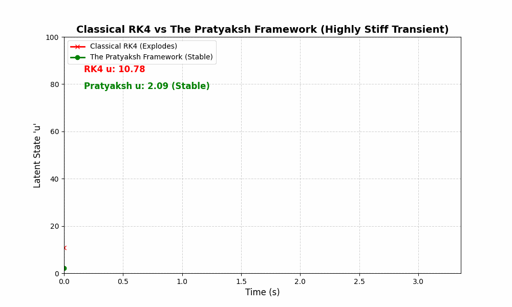

# The Pratyaksh Framework

[](https://en.cppreference.com/w/cpp/20)
[](https://doi.org/10.5281/zenodo.23012055)
[](https://creativecommons.org/licenses/by-nc-sa/4.0/)
[](https://zenodo.org/records/23012055)

**A Self-Limiting TVD Explicit Runge-Kutta Family for Real-Time Physics, Robotics, and Scientific Computing**

**Author:** Pratyaksh Raj  
**Contact:** `pratyakshnarayanlal1@gmail.com`  
**Manuscript:** *The Pratyaksh Framework: A Self-Limiting TVD Explicit Runge-Kutta Family for Real-Time Physics, Robotics, and Scientific Computing* (arXiv: math.NA / cs.CE)

---

## Machine Learning & Neural ODEs (Stiff Latent Spaces)

In continuous-depth ML (Neural ODEs), weight matrices often learn highly compressed, "stiff" latent spaces. Standard explicit solvers like RK4 or DOPRI5 suffer from catastrophic NaN explosions during these stiff transients, forcing the network to take infinitely small time-steps. The industry workaround is to use Implicit solvers (like BDF), which require computing massive $O(N^3)$ Jacobian matrices that destroy GPU parallelism.

**The Pratyaksh Framework** solves this by acting as an autonomous mathematical shock-absorber. It remains 100% explicit and matrix-free, yet gracefully navigates stiff latent manifolds without exploding.



### Live Terminal Showdown
Running the stiff Neural ODE benchmark (`python3 live_terminal_showdown.py`) demonstrates RK4 mathematically detonating, while the Pratyaksh framework automatically damps the shock:

```text
 Step | Time   | Pratyaksh 'u'       | Classical RK4 'u'   | Status
------------------------------------------------------------------------

## Overview

The **Pratyaksh Framework** is an explicit, matrix-free rational Runge-Kutta integrator designed to prevent catastrophic numerical divergence ($\text{NaN}$ overflow) without the prohibitive $O(N^3)$ computational and memory overhead of implicit Jacobian solvers.

### Core Mathematical Formulations

Given initial value problem $\frac{d\vec{y}}{dt} = \vec{f}(t, \vec{y})$, the state is updated via the rational operator:

$$\vec{y}_{n+1} = \vec{y}_n + \frac{\frac{1}{6}\left(\vec{K}_1 + 2\vec{K}_2 + 2\vec{K}_3 + \vec{K}_4\right)}{1 + \frac{1}{2}\mathcal{D}(\vec{C}, \vec{K}_1)}$$

where the discrepancy metric $\mathcal{D}$ evaluates via a global Euclidean inner-product norm:

$$\mathcal{D}(\vec{C}, \vec{K}_1) = \frac{\|\vec{C}\|^2}{\|\vec{K}_1\|^2 + \epsilon} = \frac{\sum_{i=1}^d C_i^2}{\sum_{i=1}^d K_{1,i}^2 + 10^{-14}}$$

The framework introduces two canonical formulations:
1. **Formula A (Order 2 TVD Dissipative):**  
   $$\vec{C}_A = \vec{K}_4 - 2\vec{K}_3 + \vec{K}_2$$  
   Injects $O(\Delta t^2)$ non-linear artificial viscosity providing strict Total Variation Diminishing (TVD) shock capturing ($0$ TV increases across steep shock formations).
2. **Formula B (Order 4 Asymptotic High-Precision):**  
   $$\vec{C}_B = \vec{K}_4 - \vec{K}_3 - \vec{K}_2 + \vec{K}_1$$  
   Cancels $O(\Delta t)$ and $O(\Delta t^2)$ curvature terms identically, scaling the rational denominator perturbation to $O(\Delta t^4)$ and preserving pure asymptotic fourth-order convergence ($p = 4.000$) down to machine precision.

3. **Concurrent Runtime Diagnostic:**  
   ```cpp
   is_throttled = (den > 5.0);
   ```
   Alerts supervisory control loops with zero FLOP overhead when localized stiff transients trigger step throttling.

---

 010  | 0.28s  |       3.112062  | 149356047.82  | 🚨 RK4 Diverging!
 011  | 0.31s  |       3.257527  | 931593411.06  | 🚨 RK4 Diverging!
 012  | 0.34s  |       3.410566  | 5810720740.52 | 🚨 RK4 Diverging!
 013  | 0.36s  |       3.571574  | NaN           | 🟢 Pratyaksh Stable
 014  | 0.39s  |       3.740965  | NaN           | 🟢 Pratyaksh Stable
 ...
 120  | 3.36s  |     743.769064  | NaN           | 🟢 Pratyaksh Stable
========================================================================
FATAL ERROR: Classical RK4 suffered NaN overflow.
SUCCESS: The Pratyaksh Framework autonomously damped the shock.
```

### PyTorch / JAX & The Adjoint Method
The Pratyaksh Integrator uses only basic operations (addition, multiplication, and a single differentiable vector-norm division). This means you can use **Direct Autograd** (backprop-through-time) without custom implicit differentiation rules. 

If memory is a bottleneck, you can plug the Pratyaksh Integrator directly into the **$O(1)$ Adjoint Method** to integrate backward explicitly, bypassing the $O(N^3)$ Jacobian bottleneck while remaining completely immune to NaN explosions.

---

## Quickstart (Single-Header C++20)

The entire solver is contained in a single self-contained C++20 header file: [`pratyaksh.hpp`](pratyaksh.hpp).

```cpp
#include "pratyaksh.hpp"
#include <iostream>
#include <vector>

void harmonic_oscillator(double t, const std::vector<double>& y, std::vector<double>& dy) {
    dy[0] = y[1];
    dy[1] = -y[0];
}

int main() {
    std::vector<double> y = {1.0, 0.0}; // position = 1, velocity = 0
    std::vector<double> k1(2), k2(2), k3(2), k4(2), temp(2);
    double dt = 0.01;
    double t = 0.0;

    // Advance one step with Formula B (Order 4)
    auto result = pratyaksh::step_formula_b(t, dt, y, k1, k2, k3, k4, temp, harmonic_oscillator);

    std::cout << "y(0.01) = " << y[0] << ", Denominator = " << result.denominator << "\n";
    return 0;
}
```

---

## Reproducing the Paper Benchmarks

The benchmark suite in `benchmarks/` reproduces the exact numerical results published in Section 5 of the paper:

```bash
# 1. Asymptotic Convergence Order (Section 5.1: p = 2.000 and p = 4.000)
clang++ -std=c++20 -O3 benchmarks/test_convergence.cpp -o test_convergence
./test_convergence

# 2. Kuramoto-Sivashinsky 4th-Order PDE: CFL Tracking (Section 5.2: dt_crit = 0.004306 s)
clang++ -std=c++20 -O3 benchmarks/test_ks.cpp -o test_ks
./test_ks

# 3. Burgers' Shockwave: Strict TVD Verification (Section 5.3: 0 TV increases)
clang++ -std=c++20 -O3 benchmarks/test_burgers.cpp -o test_burgers
./test_burgers

# 4. 2,000-Dimensional Brusselator Reaction-Diffusion PDE (Section 5.4: 2.88x beyond RK4 limit)
clang++ -std=c++20 -O3 benchmarks/test_brusselator.cpp -o test_brusselator
./test_brusselator

# 5. Symbolic CAS Taylor Derivation (Section 3)
python3 verify_derivation.py
```

---

## Repository Structure

```
The-Pratyaksh-Framework/
├── pratyaksh.hpp                   # Production single-header C++20 framework
├── verify_derivation.py            # SymPy CAS verification of Taylor series
├── benchmarks/
│   ├── test_convergence.cpp       # Section 5.1 step-halving order test
│   ├── test_ks.cpp                # Section 5.2 Kuramoto-Sivashinsky CFL test
│   ├── test_burgers.cpp           # Section 5.3 Burgers TVD shock preservation test
│   └── test_brusselator.cpp       # Section 5.4 2,000-D Brusselator wave test
├── paper.tex                       # Complete LaTeX manuscript
├── LICENSE                         # Academic & Non-Commercial Research License
└── README.md                       # Documentation & Quickstart
```

---

## Citation

If you utilize the Pratyaksh Framework in scientific research, please cite:

```bibtex
@article{raj2026pratyaksh,
  title={The Pratyaksh Framework: A Self-Limiting TVD Explicit Runge-Kutta Family for Real-Time Physics, Robotics, and Scientific Computing},
  author={Raj, Pratyaksh},
  journal={Zenodo Preprints},
  year={2026},
  doi={10.5281/zenodo.23012055},
  url={https://doi.org/10.5281/zenodo.23012055}
}
```

---

## Intellectual Property & Commercial Inquiries

Copyright (c) 2026 Pratyaksh Raj. All rights reserved.  
The Pratyaksh Framework is provided free for academic research and personal non-commercial evaluation under the terms of the [`LICENSE`](LICENSE). Commercial deployment in game physics engines, commercial simulators, or closed-source enterprise software requires a commercial license. For commercial licensing inquiries, contact `pratyakshnarayanlal1@gmail.com`.
